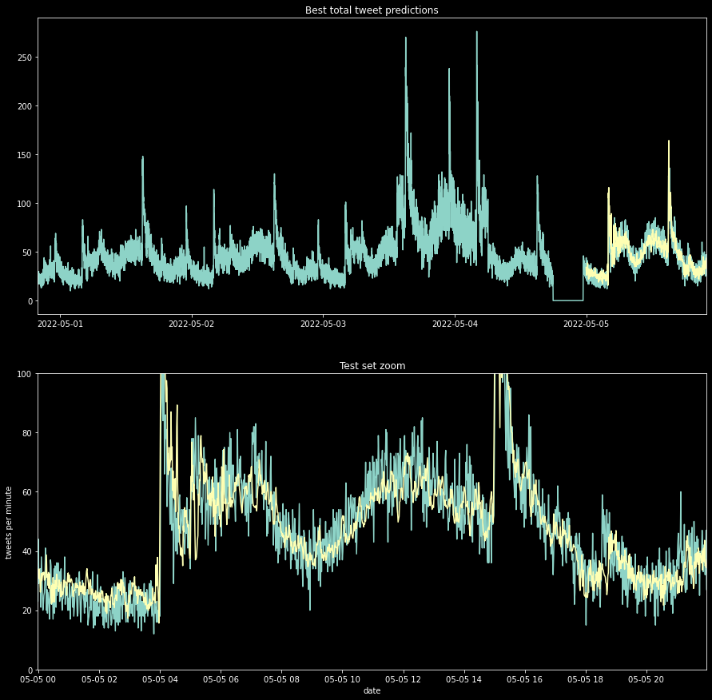

Predicting Wordle User Activity from Twitter
---

General Assembly DSIR 222 capstone project

---

This project seeks to predict the rates of Wordle-related tweets posted in early May, 2022, using a neural network trained on previous tweet rates as well as the tweets' contents. The best neural network offers a substantial improvement over the naive forecasting model, increasing the $R^2$ score for a linear fit between residuals and true values in a test set from 0.46 to 0.75.

---
Introduction to Wordle
---

[Wordle](https://www.nytimes.com/games/wordle/index.html) is a new and popular word-guessing game created by Josh Wardle and owned by the NY Times. Players guess a daily 5-letter word in six tries. For each guess, the game reveals whether any of the letters in the guess are in the solution, and whether they are in the same location in the word. Currently, the game is entirely free to play.

The game owes its popularity partly to its simplicity, accessibility, and the drip-feed format of one-word-per-day. Perhaps most importantly, however, is its way of letting user easily share their outcomes without spoiling the answer. At the end of the game, it is easy to copy a simple and easy to read textual representation of their game, showing the number of guesses and the sequence of correct letters. Here is an example game, Wordle #329 from May 14, 2022:


This example's shareable text:
```
Wordle 329 4/6

🟨⬜⬜⬜🟨
⬜⬜⬜⬜🟨
🟨🟩🟨⬜⬜
🟩🟩🟩🟩🟩
```

There is no suggestion to share to a specific service (such as Twitter, Reddit, etc.) --- the user simply copies the text like the above to the social network of their choosing.

The game has spawned a large number of unofficial variants, the most popular of which feature a similar sharing mechanism. The relationship between these and Wordle proper is uncertain. It is possible they draw attention away from the NY Times version, but they also contribute to the activity of an enthusiast community. They also provide awareness of the original game to those who may otherwise not have been aware of its existence.

---
Problem statement and motivation
---

Predict the number of Wordle-related tweets, as well as those for popular Wordle-inspired games, on a minute time scale ten minutes in advance by examining tweets.

Although Wordle is not a bandwidth-intensive game, knowing the rate at which NYTimes servers will receive requests ahead of time will allow the organization to properly allocate resources in anticipation for both seasonal changes and unexpected spikes. It would also allow them to monitor the community's activity and relationship with Wordle clones.

---
Data
---

Data were gathered using the Twitter API v2. 

Gathered Twitter data for the search '🟩 Wordle' For over the first few days of May '22. The inclusion of the green square forces the search to focus on tweets that share the results of Wordle games. Data dictionaries for the raw and final processed data are at the end of this ReadMe.

The important data were collections of fractions of tweets referring to a specific Wordle variant, written in a particular language, or posted from a certain world region. Most importantly, the data was processed and resampled into a number of tweets made per minute, as well as an interpretation of "legitimate" Wordle tweets.

---
Models
---

Over 2000 neural networks were trained on a varying number of the tweet data features, with the total tweet rate as well as the fraction of legitimate Worlde tweets as the two targets. The models included 10-20 minute lagged rates, as well as a few tweet rates from the previous day.

All of the possible parameters for the $3^7$ models are listed here:

| variable | possible values |
| --- | --- | 
| number of layers | 1, 2, 3 |
| early stopping patience | 0, 5, 10 |
| number of minutes around 24-hour lag to monitor tweet rates | 0, 5, 10 |
| number of minutes to look at, starting 10 minutes before | 0, 5, 10 |
| number of top locations frequencies to monitor | 0, 12, 25 |
| number of top game types frequencies to monitor | 0, 12, 25 |
| number of top tweet languages frequencies to monitor | 0, 10, 20 |

The final, "best" model is a keras dense Sequential() neural network with three layers, and trained with an EarlyStopping procedure with low patience. It has three non-output layers, 0 or 5 EarlyStopping patience, and the maximum values for all of the above collections of data. The model itself, along wth the other trained models, is saved in the [saved_models](./model/saved_models/) folder as `NN_3_10_10_20_25_25_5`. It produced the following two sets of predictions on the test set at the end of the data, on May 5.




The $R^2$ values for a linear fit between the residuals and true values were calculated for these models as well as their corresponding naive models. They offered a substantial improvement in forecasting power:

| model | $R^2$ total tweets | $R^2$ wordle fraction |
| --- | --- | --- |
| Best trained neural network |  0.748 | 0.548 | 
| Ten-minute lagged naive model | 0.455 | 0.207 |

This quick to train (less than two minutes!) neural network could be continuously retrained on new tweet data to continue forecasting the near-future number of posts. It could also be extended to cover any topic on twitter with a large number of posts, and expanded to include real-time adjustment of the set and number popular languages, locations, hashtags, or other features trained upon.

---
Repository Structure
---


### core notebooks

The repository consists of a top level with five 'core' notebooks:

[Data_acquisition](./1_data_acquisition.ipynb)

[Data cleanup](./2_data_cleanup.ipynb)

[EDA](./3_EDA.ipynb)

[Preprocessing](./4_preprocessing.ipynb)

[Models](./5_models.ipynb)

These notebooks contain the entirety of this project's procedures. Their contents describe the process of gathering data, cleaning and merging it, exploring and fitting it to the neural network models. Anyone interested in understanding the complete data process only needs to follow through these in order. 

They are not the original notebooks where these procedures were developed. Those draft notebooks are contained in folders within this top level. Only someone interested in following the development process needs to look at them, where more informal language and notes to self abound. Some cells in these scratch notebooks may not run correctly.

### draft notebooks

[data_acquisition/](./data_acquisition/)

    - 1_twitter_search.ipynb
        An initial review and practice with gathering tweets and user data
    - 2_data_acquisition.ipynb
        Notebook which gathered tweets and user data in many stages
    - 3_data_cleanup.ipynb
        fixing ids, merging tweets and merging users data
        
[EDA/](./EDA/)

    - 4_EDA.ipynb
        The first informal exploratory data analysis
        
[model/](./model/)

    - 1_time_series_arima.ipynb
        A failed attempt to fit tweet rates with an ARIMA model.
    - 2_simple_nn.ipynb
        An initial neural network fit for practice.
    - 3_preprocessing.ipynb
        Prepares data for modeling
    - 4_models.ipynb
        Runs fits for 2000+ neural networks
        
### data folders

Data are stored in three different folders.

- [raw_data](./raw_data/) contains the numerous .csvs saved by the intial search. These are separated into nearly 600 total csvs for tweets, associated users, and "id-fixed" user data.
- [merged_data](./merged_data/) contains data merged by the cleanup notebook, ready to be explored in the EDA notebook. It also saves the touched-up, tweet/user merged data set to be sent to preprocessing.
- [processed_data](./processed_data/) contains the data created in the preprocessing step, ready to be imported by the modeling notebook.

Data dictionaries for the raw_data and processed_data may be found at the bottom of this ReadMe. The merged_data is explored thoroughly in the EDA notebook.

### presentation slides

Two slide decks are contained in this repo, one in [topic_lightning_talk](./topic_lightning_talk/) and one in [final_talk](./final_talk/). The first is a set of short proposals for capstone projects. The second was for a presentation to share the results of the project on May 16, 2022.

---
Processed data -- Data dictionary
---

The processed data fed into the models is a value for every minute during the period between April 29, 2022 19:46 UTC and May 5, 2022 21:59 UTC.

| name | type | description |
| --- | --- | --- |
| hour | int64 | hour of day, UTC |
| minute | int64 | minute of the hour |
| --- | --- | --- |
| is_wordle | float64 | Fraction of tweets within the minute referring to a game of Wordle proper, from the NY Times. One of two targets. |
| total_tweets | int64 | Number of total tweets during the minute. One of two targets. |
|lag_10| float64 | Number of total tweets ten minutes lagged |
|lag_11|  float64 | Number of total tweets eleven minutes lagged |
|lag_12| float64 | Number of total tweets twelve minutes lagged |
|lag_13| float64 | Number of total tweets thirteen minutes lagged |
|lag_14| float64 | Number of total tweets fourteen minutes lagged |
|lag_15| float64 | Number of total tweets fifteen minutes lagged |
|lag_16| float64 | Number of total tweets sixteen minutes lagged |
|lag_17| float64 | Number of total tweets seventeen minutes lagged |
|lag_18| float64 | Number of total tweets eighteen minutes lagged |
|lag_19| float64 | Number of total tweets nineteen minutes lagged |
| lag_day_-10 | float64 | Number of total tweets one day and ten minutes lagged |
| lag_day_-9 | float64 | Number of total tweets one day and nine minutes lagged |
| lag_day_-8 | float64 | Number of total tweets one day and eight minutes lagged |
| lag_day_-7 | float64 | Number of total tweets one day and seven minutes lagged |
| lag_day_-6 | float64 | Number of total tweets one day and six minutes lagged |
| lag_day_-5 | float64 | Number of total tweets one day and five minutes lagged |
| lag_day_-4 | float64 | Number of total tweets one day and four minutes lagged |
| lag_day_-3 | float64 | Number of total tweets one day and three minutes lagged |
| lag_day_-2 | float64 | Number of total tweets one day and two minutes lagged |
| lag_day_-1 | float64 | Number of total tweets one day and one minute lagged |
| lag_day_0 | float64 | Number of total tweets one day lagged |
| lag_day_1 | float64 | Number of total tweets one day minus one minute lagged |
| lag_day_2 | float64 | Number of total tweets one day minus two minutes  lagged |
| lag_day_3 | float64 | Number of total tweets one day minus three minutes  lagged |
| lag_day_4 | float64 | Number of total tweets one day minus four minutes lagged |
| lag_day_5 | float64 | Number of total tweets one day minus five minutes lagged |
| lag_day_6 | float64 | Number of total tweets one day minus six minutes lagged |
| lag_day_7 | float64 | Number of total tweets one day minus seven minutes lagged |
| lag_day_8 | float64 | Number of total tweets one day minus eight minutes lagged |
| lag_day_9 | float64 | Number of total tweets one day minus nine minutes lagged |
| lag_day_10 | float64 | Number of total tweets one day minus ten minutes lagged |
| --- | --- | --- |
| language_is_English | float64 | fraction of tweets identified as English by Twitter |
| language_is_Japanese | float64 | fraction of tweets identified as Japanese by Twitter |
| language_is_Spanish | float64 | fraction of tweets identified as Spanish by Twitter |
| language_is_Turkish | float64 | fraction of tweets identified as Turkish by Twitter |
| language_is_French | float64 | fraction of tweets identified as French by Twitter |
| language_is_Korean | float64 | fraction of tweets identified as Korean by Twitter |
| language_is_German | float64 | fraction of tweets identified as German by Twitter |
| language_is_Catalan | float64 | fraction of tweets identified as Catalan by Twitter |
| language_is_Russian | float64 | fraction of tweets identified as Russian by Twitter |
| language_is_Estonian | float64 | fraction of tweets identified as Estonian by Twitter |
| language_is_Thai | float64 | fraction of tweets identified as Thai by Twitter |
| language_is_Tagalog | float64 | fraction of tweets identified as Tagalog by Twitter |
| language_is_Dutch | float64 | fraction of tweets identified as Dutch by Twitter |
| language_is_Czech | float64 | fraction of tweets identified as Czech by Twitter |
| language_is_Portuguese | float64 | fraction of tweets identified as Portuguese by Twitter |
| language_is_Indonesian  | float64 | fraction of tweets identified as Indonesian by Twitter |
| language_is_Chinese  | float64 | fraction of tweets identified as Chinese by Twitter |
| language_is_Finnish   | float64 | fraction of tweets identified as Finnish by Twitter |
| language_is_Norwegian  | float64 | fraction of tweets identified as Norwegian by Twitter |
| language_is_Romanian  | float64 | fraction of tweets identified as Romanian by Twitter |
| language_is_Italian  | float64 | fraction of tweets identified as Italian by Twitter |
| language_is_Arabic | float64 | fraction of tweets identified as Arabic by Twitter |
| language_is_Danish  | float64 | fraction of tweets identified as Danish by Twitter |
| language_is_Welsh  | float64 | fraction of tweets identified as Welsh by Twitter |
| language_is_Swedish  | float64 | fraction of tweets identified as Swedish by Twitter |
| --- | --- | --- |
|game_from_hashtag_ポケモンWordle| float64 | fraction of tweets identified as Pokemon JP from hashtag |
|game_from_hashtag_Wordle|float64 | fraction of tweets identified as Wordle from hashtag |
|game_from_hashtag_wordle|float64 | fraction of tweets identified as wordle from hashtag |
|game_from_hashtag_WordleCAT|float64 |  fraction of tweets identified as Wordle Catalan from hashtag |
|game_from_hashtag_вордли|float64 | fraction of tweets identified as Wordle Russian from hashtag |
| game_from_hashtag_Heardle|float64 |  fraction of tweets identified as Heardle from hashtag
 |game_from_hashtag_워들|float64 |  fraction of tweets identified as Wordle Korean from hashtag |
 |game_from_hashtag_한글|float64 |  fraction of tweets identified as Wordle Korean from hashtag |
 |game_from_hashtag_Korean|float64 | fraction of tweets identified as Wordle Korean from hashtag |
 |game_from_hashtag_wordleTR|float64 |  fraction of tweets identified as Wordle Turkish from hashtag |
 |game_from_hashtag_AlWird|float64 | fraction of tweets identified as Wordle Arabic from hashtag |
 |game_from_hashtag_galego|float64 | fraction of tweets identified as Galician from hashtag |
 |game_from_hashtag_WordleGalego|float64 |  fraction of tweets identified as Galician from hashtag |
 |game_from_hashtag_DailyWordleClub|float64 | fraction of tweets associated with a Daily Wordle Club from hashtag |
 |game_from_hashtag_WordleEnglish|float64 | fraction of tweets identified as Wordle English from hashtag |
 |game_from_hashtag_WordleEN|float64 | fraction of tweets identified as Wordle English from hashtag |
 |game_from_hashtag_WordleEUS|float64 | fraction of tweets identified as Wordle Basque from hashtag |
 |game_from_hashtag_hadesjSlova|float64 |  fraction of tweets identified as Wordle Czech from hashtag |
 |game_from_hashtag_WORDLE_TAMIL|float64 | fraction of tweets identified as Wordle Tamil from hashtag |
 |game_from_hashtag_WizardingWordle|float64 |  fraction of tweets identified as Wizarding Wordle from hashtag |
 |game_from_hashtag_Enstarsdle|float64 |  fraction of tweets identified as Enstars Wordle from hashtag |
 |game_from_hashtag_WordleEspañol|float64 |  fraction of tweets identified as Spanish from hashtag |
 |game_from_hashtag_wordleES|float64 |  fraction of tweets identified as Spanish from hashtag |
 |game_from_hashtag_嘘wordle|float64 |  fraction of tweets identified as Japanese from hashtag |
 |game_from_hashtag_百人一首Wordle|float64 | fraction of tweets identified as Japanese from hashtag |
 |game_from_hashtag_Quordle|float64 |  fraction of tweets identified as Quordle from hashtag |
 |game_from_hashtag_ことのはたんご|float64 |  fraction of tweets identified as Kotonoha Wordle from hashtag |
 |game_from_hashtag_NYTimes|float64 | fraction of tweets identified as NYTimes Wordle from hashtag |
| --- | --- | --- |
|broad_location_is_USAE | float64 | fraction of tweets whose user reports from USA eastern time |
|broad_location_is_UK| float64 | fraction of tweets whose user reports from United Kingdom|
| broad_location_is_JPN| float64 | fraction of tweets whose user reports from Japan |
| broad_location_is_ES| float64 | fraction of tweets whose user reports from Spain |
| broad_location_is_USAC| float64 | fraction of tweets whose user reports from USA central time |
|broad_location_is_USA| float64 | fraction of tweets whose user reports from USA |
| broad_location_is_USAW| float64 | fraction of tweets whose user reports from USA western time |
| broad_location_is_IN| float64 | fraction of tweets whose user reports from India |
| broad_location_is_ASTL| float64 | fraction of tweets whose user reports from Australia|
| broad_location_is_CAE| float64 | fraction of tweets whose user reports from Canada eastern time |
| broad_location_is_AR| float64 | fraction of tweets whose user reports from Argentina|
| broad_location_is_USAM| float64 | fraction of tweets whose user reports from USA mountain time |
| broad_location_is_IE| float64 | fraction of tweets whose user reports from Ireland |
| broad_location_is_TK| float64 | fraction of tweets whose user reports from Turkey|
| broad_location_is_CA| float64 | fraction of tweets whose user reports from Catalonia |
| broad_location_is_MX| float64 | fraction of tweets whose user reports from Mexico |
| broad_location_is_PH| float64 | fraction of tweets whose user reports from The Phillipines |
| broad_location_is_NZ| float64 | fraction of tweets whose user reports from New Zealand |
| broad_location_is_CL| float64 | fraction of tweets whose user reports from Chile |
| broad_location_is_SA| float64 | fraction of tweets whose user reports from South Africa |
| broad_location_is_EUR| float64 | fraction of tweets whose user reports from Europe |
| broad_location_is_CAW| float64 | fraction of tweets whose user reports from Canada western time |
| broad_location_is_MY| float64 | fraction of tweets whose user reports from Malaysia |
| broad_location_is_CAM| float64 | fraction of tweets whose user reports from Canada mountain time |
| broad_location_is_CO| float64 | fraction of tweets whose user reports from Colombia |

---
Raw data --- Data dictionaries
---

Data gathered from Twitter was in response to an API v2 search for '🟩 Wordle', which returns tweets that have at least one green square and one instance of 'Wordle' within their text. Details for any of the data in `tweets` or `users` can be found at [Twitter API v2 docs](https://developer.twitter.com/en/docs/twitter-api/tweets/search/api-reference/get-tweets-search-recent).

Twitter retrieves tweets and user data in batches of 100-tweets maximum. The data was gathered and collected in batches of about 1000 tweets per file and stored as csvs in the [raw_data folder](#./raw_data). User data associated with the tweets is also saved in that folder.

Separate user data files of the format `users_idfixed_XX.csv` is also stored there. The original user data had an error in saving the unique user id in the correct column. These are that data copied with the format used in the EDA notebook.

### tweets

| name | type | description |
| --- | --- | --- |
| id | int |  unique tweet identifier |
| conversation_id | int | identifier for "root" tweet. Same as id if not a reply or retweet. |
| reply_settings | str | Who may reply to this tweet |
| lang | str | Twitter-assigned language |
| entities | str (json) | Dictionary of objects like url links within the tweet |
| possibly_sensitive | bool | Twitter-assigned sensitivity rating |
| source | str | name of software used to tweet |
| public_metrics | str (json) | Dictionary of counts of retweets, replies, likes, quotes |
| text | str | The text of the tweet |
| context_annotations| str (list of jsons) | Twitter-assigned context values, like franchises or topics |
| author_id | int | unique identifier of the author |
| created_at | str | UTC time of tweet submission |
| referenced_tweets | int | id or list of ids of any referenced, retweeted, quoted tweets |
| in_reply_to_user_id | int | unique identifier of user who posted tweet this tweet replies to |
| attachments | str (json) | information for attached media |
| geo | int | unique geographic location, if shared |
| withheld | bool | whether the tweet has been withheld for legal demand |

### users

| name | type | description |
| --- | --- | --- |
| id | int | unique identifier of user. Same as a tweet's `author_id` |
| name | str | Name of user |
| public_metrics | str (json) | followers and following counts |
| url | str | User-shared url |
| description | str | User's description |
| profile_image_url | str | link to profile image |
| location | str | User-written location |
| protected | bool | Privacy setting |
| username | str | Username (following the @) |
| verified | bool | whether the user is Twitter verified |
| entities| str (json) | information on any included media or urls |
| pinned_tweet_id | int | unique identifier for a user's currently pinned tweet |
| withheld | bool | whether the account has been suspended |